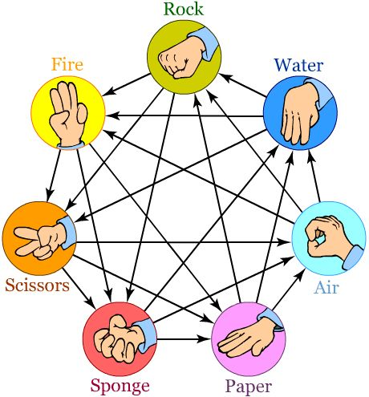
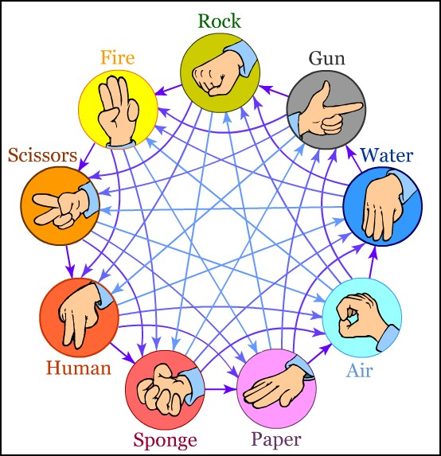

# PIEDRA - PAPEL - TIJERAS

_En este proyecto se programó el clásico "piedra papel tijeras" y sus diferentes versiones para jugar online contra la computadora._

- PPT clásico (tres opciones). [Ver reglas](#ppt-clásico)
- PPT Lagarto Spock (cinco opciones). [Ver reglas](#ppt-lagarto-spock)
- PPT avanzado (siete opciones).  [Ver reglas](#ppt-avanzado)
- PPT extremo (nueve opciones). [Ver reglas](#ppt-extremo)

## 1 - Dinámica del juego

Cada paso del usuario va habilitando las opciones subsiguientes

### 1.1 - Elección de modo de juego

En la pantalla principal se elige el modo de juego. Cada botón redirecciona a su propio sitio. Se mantiene por separado para configurar cuestiones particulares de cada modo de juego sin tener que incluir esas variables dentro del JS. Se podría mejorar trabajando como componentes en Angular y que se cargue el modo de juego en función de la elección del jugador dentro de la misma página

### 1.2 - Elección de nombre

El usuario debe elegir un nombre y presionar enter. Si el campo está vacío o incumple alguna de las restricciones del form, no permite continuar y no aparece el mensaje de bienvenida.

### 1.3 - Cantidad de puntos para ganar

A continuación el usuario elige la cantidad de puntos necesarios para ganar. Eso se almacena en una variable y controla cuando termina la partida. Si no se elige la cantidad de puntos no se habilita el juego.

### 1.4 - Juego

Una vez elegidas las configuraciones anteriores, se generan los botones con las opciones a elegir por el usuario.
Cada vez que el usuario elige una opción, el resto ocurre automáticamente:
- la computadora hace su elección.
- muestra en pantalla la elección de ambos.
- muestra el resultado de la jugada, con mensaje personalizado.
- muestra el score parcial.
- si alguno de los jugadores llega a la cantidad de puntos definidos en la sección 1.3, se determina el ganador con mensaje personalizado.

### 1.5 - Resetear partida o cambiar de modo
Para cambiar de modo, al principio de la página da las opciones del resto de los modos de juego disponibles. (Se considera la alternativa de mover estas opciones al final de la página o de cambiar su estructura para mejorar su visualización).
Para resetear una partida, una vez iniciada el usuario cuenta con un botón al fondo de la página, el cual retorna a la opción de indicar cantida de puntos para ganar (sección 1.3).
El reseteo puede realizarse en cualquier momento de la partida, aún si esta no ha terminado. Si la partida ha finalizado, es la única forma de reiniciar y que el usuario pueda continuar jugando (sin necesidad de refrescar la página).

## 2 - Testing 🚀 

El juego ha sido testeado en sus diferentes versiones, tanto en la jugabilidad, puntaje, respuestas según la jugada y la correcta elección de opciones por la computadora.

## 3 - Aspectos a mejorar ⚙️

- Mejorar la interfaz para que sea más intuitiva para el usuario (a veces los jugadores no interpretan que tienen que volver a apretar un botón para seguir jugando).
- Hacer transiciones más suaves para mostrar los eventos del juego (jugadas, resultados, puntaje, etc).
- Mejorar la visualización de la opción elegida por la computadora. Que no sea un texto y cambiarlo por algo más visual.

## Modos de juego

A continuación se muestra los diagramas con las combinaciones de resultados según la elección de cada jugador:

### PPT Clásico

### PPT Lagarto Spock

### PPT avanzado

### PPT extremo

